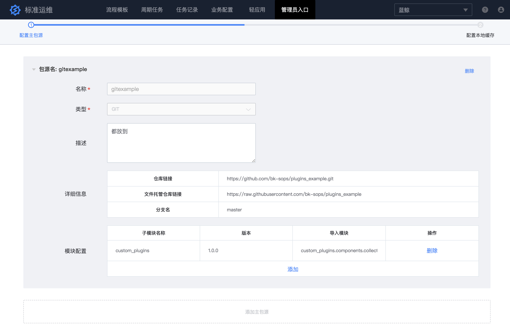
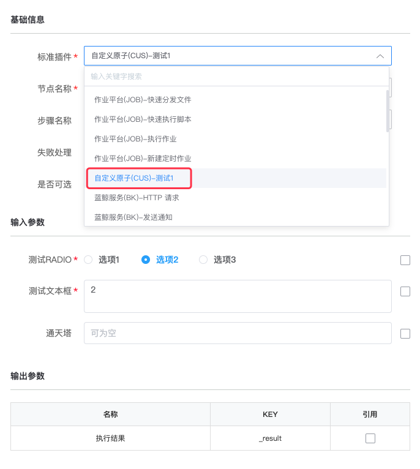

# 标准插件远程加载

## 功能概述
标准插件远程加载功能可以让用户不修改标准运维源码就可以加载第三方插件，主要是为了解决标准插件开发和维护流程复杂的问题。 在之前的版本中，
用户如果想开发自定义插件，并发布到官方标准运维 SaaS 上使用，一般需要先拉取 bk-sops 源码在本地开发插件，测试通过后，
还需要把官方标准运维SaaS版本包在本地解压，然后添加自定义插件包到版本包中，并修改部分 settings 配置，然后重新打包并上传部署；
如果自定义插件需要额外安装 python依赖包，那么用户还需要[在 CentOS 机器上执行打包脚本](../install/source_code_deploy.md)才能完成官方 S-mart 
应用打包操作。并且，后续用户开发的自定义插件有任何版本变动，都需要重新打包、上传、部署，维护成本很高。

针对上述的用户痛点，标准运维新版本提供了"标准插件远程加载"功能，让用户可以不需要解压官方包以及重新打包，只需要在自定义插件开发测试完成后，
在标准运维配置自定义插件包源信息，然后重新部署应用，就能自动加载插件。

## 实现原理
标准运维基于[《PEP 302 -- New Import Hooks》](https://www.python.org/dev/peps/pep-0302/)的建议规范，通过扩展 `imp` 模块，
实现了从 Git、S3、文件系统等文件托管源加载 python 源码的能力，并通过页面配置的方式暴露接口给用户填写远程插件包源配置。

更进一步，为了避免每次发布部署都需要重新从远程拉取插件代码，可能会因为网络策略、网络抖动等原因导致加载插件失败，
标准运维基于 [Boto 3](https://github.com/boto/boto3) 和 [GitPython](https://github.com/gitpython-developers/GitPython) 模块，
实现了远程 Git、S3、文件系统等包源同步到 S3、文件系统等本地缓存源的能力，这样用户只需要在需要更新外网托管的远程插件时才需要打通网络策略，
普通的发布部署都从本地缓存加载上一次同步的包源代码即可。

## 快速入门

### 1. 开发标准插件
请参考[标准插件开发](../develop/dev_plugins.md)，注意务必按照章节《标准插件远程加载》的要求，完成插件远程加载改造。

### 2. 托管标准插件包源
标准运维支持 Git、S3、文件系统这三类文件托管源，完成标准插件开发后，需要将整个插件包上传到蓝鲸SaaS服务器可以访问的 Git、Ceph、NFS 
等标准运维支持的文件系统上托管，文件目录参考标准插件开发文档中《初始化插件模块》章节。

### 3. 配置远程插件包源
使用有管理员权限的账号登录标准运维，进入"管理员入口"的"后台管理页面"，新增主包源配置。如果是 Git 类型，需要填写仓库链接、文件托管仓库链接、
分支名，注意文件托管链接的可以通过在Git网页端点击任意文件的"Raw"按钮，然后复制链接中分支名之前的部分获取。

如果是 S3 类型，需要填写对象存储服务地址、存储桶 Bucket 名称、Access Key、Secret Key。

如果是文件系统类型，需要填写标准运维 SaaS 后台服务器可访问的文件路径，建议通过 NFS 的方式挂载，
避免重新部署 SaaS 导致文件丢失或者多服务实例共享文件同步复杂的问题。

不论主包源选择以上哪种类型，都需要配置包源希望加载的插件模块信息，同一个主包源可以包含多个插件集合，每个插件集合需要配置子模块、版本号、
导入模块，其中子模块是插件包根目录；版本号用来表示当前插件集合的版本，在每次插件变更时更新；导入模块是插件集合中的文件 python 导入路径，
多个用英文逗号 `,` 分隔。

### 4. 配置环境变量并重新部署标准运维
进入开发者中心，找到标准运维SaaS，首先在"环境变量"页面添加变量名是 `BKAPP_EXTERNAL_PLUGINS_SOURCE_SECURE_LOOSE` 的环境变量，
值为 1 表示允许 HTTP 和 HTTPS 协议的远程插件包源地址，值为 0 表示只能从 HTTPS 协议的远程插件包源地址。配置完全局变量后，
在"发布部署"页面进行正式环境的"一键部署"操作，等待部署完成，就可以在流程编辑中找到远程插件包源中的自定义插件了。

## 示例

### GitHub 托管标准插件案例

- GitHub 仓库插件目录结构
https://github.com/bk-sops/plugins_example

- 标准运维远程包源配置

- 重新部署后成功加载插件效果
在"新建流程"中编辑默认的标准插件节点，可以看到远程插件包源中的"自定义原子(CUS)-测试1"，并且选择该插件后页面渲染正常。

## 常见问题

- 添加远程包源后重新部署了标准运维，但是在流程编辑中未找到新开发的插件，可能是什么原因？
> 可是是网络错误或者配置错误，导致远程插件加载失败，建议前往日志查看是否有 ERROR 级别的错误信息，进一步排查具体原因。
